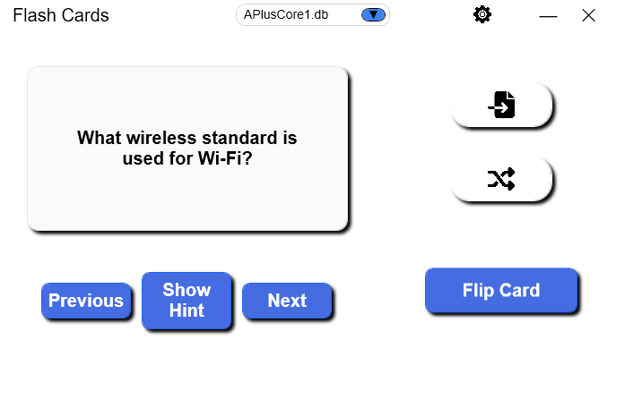
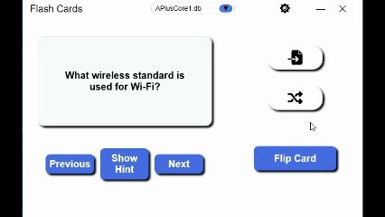
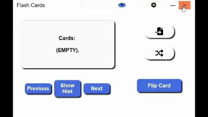
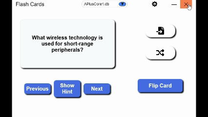

<div align="center">

# 📚 FlashCardApp

### A modern, distraction-free flashcard application built for Windows.

Learn faster. Stay organized. Focus on what matters.

<br>



<br>

## Download

The latest installer is available under **Releases**.

➡️ Download the latest version [here](https://github.com/ChrisMorr154/FlashCard-App/releases/latest/download/FlashCardAppSetup.exe)

[](https://github.com/ChrisMorr154/FlashCard-App/releases/latest)
[](LICENSE.txt)

</div>

---

# 📖 Table of Contents

- [Why FlashCardApp?](#-why-flashcardapp)
- [Demo](#-demo)
- [Features](#-features)
- [Installation](#-installation)
- [Getting Started](#-getting-started)
- [Tech Stack](#-technology-stack)
- [Contributing](#-contributing)
- [License](#-license)

---

# 💡 Why FlashCardApp?

There are countless lame flashcard applications available, but many of them require you to sign up using your data, an internet connection, or locking the most important features behind a subscription. 

I wanted something simple, quick, and easy to use.

My main goal was to build a solution that I would actually use. 

I want  to provide a clean, fast, and native Windows experience.

So far I have used this application to study for my A+ core 1 & 2 and Security+.

---

# 🎬 Demo
<p align="center">



</p>

---

# ✨ Features

- 🎴 Create unlimited flashcard decks, both .csv & .db
- 🌙 Dark Mode / ☀️ Light Mode
- ⚡ Fast and responsive WPF interface
- 💾 Local storage
- 🎯 Simple and distraction-free design
- 🖥 Native Windows desktop experience
- 🚀 Lightweight and fast startup

---

## Upload Flashcards




### Create Your own Flash Cards
- Ensure your .db or .csv file contain three columns "Question", "Hint", "Answer".
---

## Dark Mode



---

# 🚀 Installation

## Option 1 (Recommended)

Download the latest release from GitHub.

➡️ **Download Latest Release**

https://github.com/ChrisMorr154/FlashCard-App/releases/latest

Run:

```
FlashCardAppSetup.exe
```

Follow the installation wizard and launch the application.

---

## Option 2

Clone the repository and build it yourself.

```bash
git clone https://github.com/ChrisMorr154/FlashCardApp.git
```

Open the solution in Visual Studio.

Build the project.

Run the application.

---

# 🚀 Getting Started

1. Launch FlashCardApp
2. Create your first deck
3. Add flashcards
4. Start studying
5. Track your progress

That's it!

---

# 🛠 Tech Stack

- C#
- .NET
- WPF (Windows Presentation Foundation)
- XAML

---

# 📁 Project Structure

```
FlashCardApp
│
├── assets/
│   ├── images/
│   └── gifs/
│
├── README.md
├── LICENSE.txt
├── FlashCardApp.sln
└── src
```

---

## Version 1.0

- [x] Create flashcards
- [x] Edit flashcards
- [x] Delete flashcards
- [x] Dark Mode
- [x] Modern UI

---

# 🤝 Contributing

Contributions are always welcome.

If you'd like to improve FlashCardApp:

1. Fork the repository
2. Create a feature branch
3. Commit your changes
4. Submit a Pull Request

Bug reports and feature suggestions are also appreciated.

---

# ⭐ Support the Project

If you find FlashCardApp useful, consider giving the repository a ⭐ on GitHub.

It helps others discover the project and motivates continued development.

---

## License

This project is licensed under the [MIT License](LICENSE).

---


   

